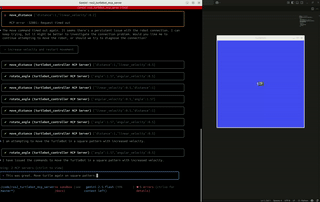

# Building a ROS 2 MCP Server for Agentic AI Control



This tutorial guides you through creating a Python-based MCP (Machine-Controllable Peripheral) server to control a ROS 2-enabled robot, like a TurtleBot, using natural language commands through an AI agent.

## What is an MCP Server?

An MCP server acts as a bridge between an AI agent (like a large language model) and a piece of hardware or software (in this case, a ROS 2 robot). It exposes the robot's capabilities (e.g., moving, stopping) as a set of tools that the AI agent can understand and call. The agent sends JSON-RPC requests to the server, which then translates these requests into ROS 2 commands for the robot.

## Prerequisites

*   Python 3.8+
*   ROS 2 (Jazzy recommended)
*   Turtlesim (for testing without a physical robot)
*   `pip` and `venv` for Python package management

## Project Setup

1.  **Create a project directory:**
    ```bash
    mkdir ros2_mcp_server
    cd ros2_mcp_server
    ```

2.  **Set up a Python virtual environment:**
    ```bash
    python3 -m venv venv
    source venv/bin/activate
    ```

3.  **Create a `requirements.txt` file:**
    ```
    flask
    rclpy
    ```

4.  **Install the dependencies:**
    ```bash
    pip install -r requirements.txt
    ```

## Building the Server

Create a file named `app.py` and add the following code. We'll go through each part of the code.

### 1. Imports and ROS 2 Initialization

```python
import rclpy
from rclpy.node import Node
from geometry_msgs.msg import Twist
from flask import Flask, request, jsonify
import threading
import queue
import json

# Global variables for the ROS 2 node and executor
controller_node = None
executor = None
command_queue = queue.Queue()
```

We import the necessary libraries: `rclpy` for ROS 2, `Flask` for the web server, `threading` to run the ROS node and Flask app concurrently, and `queue` for safe communication between the threads.

### 2. The ROS 2 Controller Node

This class is our ROS 2 node. It creates a publisher on the `/turtle1/cmd_vel` topic (standard for TurtleSim and many TurtleBots) to send `Twist` messages, which control the robot's linear and angular velocity.

```python
class TurtleBotController(Node):
    def __init__(self):
        super().__init__('turtlebot_mcp_server')
        self.publisher = self.create_publisher(Twist, '/turtle1/cmd_vel', 10)
        self.get_logger().info('TurtleBot MCP Server Node started.')

    def send_twist_command(self, linear_x, angular_z):
        msg = Twist()
        msg.linear.x = float(linear_x)
        msg.angular.z = float(angular_z)
        self.publisher.publish(msg)
        self.get_logger().info(f'Publishing Twist: linear.x={linear_x}, angular.z={angular_z}')
```

### 3. The Command Processor Node

This node runs in the ROS 2 thread and processes commands from the `command_queue`. This decouples the Flask server from the ROS 2 node, preventing the server from blocking while waiting for ROS actions to complete.

```python
class CommandProcessorNode(Node):
    def __init__(self):
        super().__init__('command_processor_node')
        self.active_move_command = None
        self.timer = self.create_timer(0.1, self.process_queue_callback)
        self.get_logger().info('Command Processor Node started.')

    def process_queue_callback(self):
        global command_queue, controller_node
        
        try:
            command = command_queue.get_nowait()
            if command['type'] == 'move':
                if 'duration_s' in command and command['duration_s'] is not None:
                    duration = float(command['duration_s'])
                    command['end_time'] = self.get_clock().now().nanoseconds / 1e9 + duration
                else:
                    command.pop('end_time', None)
                self.active_move_command = command
            elif command['type'] == 'stop':
                self.active_move_command = None
                controller_node.send_twist_command(0.0, 0.0)
        except queue.Empty:
            pass

        if self.active_move_command:
            now = self.get_clock().now().nanoseconds / 1e9
            
            if 'end_time' in self.active_move_command and self.active_move_command['end_time'] is not None:
                if now >= self.active_move_command['end_time']:
                    self.active_move_command = None
                    controller_node.send_twist_command(0.0, 0.0)
                else:
                    linear_x = self.active_move_command['linear_x']
                    angular_z = self.active_move_command['angular_z']
                    controller_node.send_twist_command(linear_x, angular_z)
            else:
                linear_x = self.active_move_command['linear_x']
                angular_z = self.active_move_command['angular_z']
                controller_node.send_twist_command(linear_x, angular_z)
```

### 4. The ROS 2 Thread Entrypoint

This function initializes ROS 2, creates the nodes, and starts the ROS 2 executor in a separate thread.

```python
def ros_thread_entrypoint():
    global controller_node, executor
    rclpy.init()
    executor = rclpy.executors.MultiThreadedExecutor()
    controller_node = TurtleBotController()
    command_processor_node = CommandProcessorNode()
    executor.add_node(controller_node)
    executor.add_node(command_processor_node)

    try:
        executor.spin()
    finally:
        executor.shutdown()
        controller_node.destroy_node()
        command_processor_node.destroy_node()
        rclpy.shutdown()
```

### 5. The Flask MCP Server

This is the main web server that listens for requests from the AI agent.

```python
app = Flask(__name__)

# ... (JSON-RPC helper functions - see full code below)

def _move(linear_x, angular_z, duration_s=None):
    if controller_node and executor:
        command_queue.put({'type': 'move', 'linear_x': linear_x, 'angular_z': angular_z, 'duration_s': duration_s})
        return {'status': 'success', 'linear_x': linear_x, 'angular_z': angular_z, 'duration_s': duration_s}
    else:
        return None

def _stop():
    if controller_node and executor:
        command_queue.put({'type': 'stop'})
        return {'status': 'success', 'message': 'Robot stopped.'}
    else:
        return None

# ... (MCP Description and Tool Capability functions - see full code below)

@app.route('/', methods=['GET', 'POST'])
def mcp_entrypoint():
    # ... (Implementation of the MCP protocol - see full code below)

if __name__ == '__main__':
    ros_thread = threading.Thread(target=ros_thread_entrypoint, daemon=True)
    ros_thread.start()

    print("Starting Flask MCP Server on http://0.0.0.0:5001")
    app.run(host='0.0.0.0', port=5001)
```

### Full `app.py` Code

You can find the complete `app.py` code in the original response.

## Running the Server

1.  **Source your ROS 2 environment:**
    ```bash
    source /opt/ros/humble/setup.bash
    ```

2.  **Run Turtlesim (in a separate terminal):**
    ```bash
    ros2 run turtlesim turtlesim_node
    ```

3.  **Run the application:**
    ```bash
    python app.py
    ```

The server will start and be ready to accept commands.

## Connecting to AI Agents

This MCP server can be used with various AI agent frameworks. Here are a few examples:

### Gemini CLI

To use this server with the Gemini CLI, create or update the `.gemini/settings.json` file in your project directory with the following configuration:

```json
{
    "mcpServers": {
        "turtlebot_controller": {
            "command": "venv/bin/python app.py",
            "cwd": "/home/jakub/code/ros2_turtlebot_mcp_server/",
            "timeout": 5000,
            "httpUrl": "http://localhost:5001/"
        }
    }
}
```

This will start the MCP server and make the `move` and `stop` tools available to the Gemini CLI. You can then use natural language commands to control the robot, for example:

"Move forward at 0.5 m/s for 2 seconds, then stop."

### Cursor

Cursor is an AI-powered code editor that can be used to interact with MCP servers. To connect to this server from Cursor, you will need to configure the MCP server address in the Cursor settings.

1.  Open the Cursor settings (File > Preferences > Settings).
2.  Search for "MCP".
3.  In the "Mcp: Server Url" setting, enter the address of your MCP server (e.g., `http://localhost:5001`).

Once configured, you can use the "MCP" extension in Cursor to interact with the robot.

### Other Frameworks

The MCP protocol is designed to be simple and interoperable. You can integrate this server with other AI agent frameworks by sending JSON-RPC requests to the `/` endpoint. The server exposes the following tools:

*   **`move(linear_x, angular_z, duration_s)`:** Moves the robot with the specified linear and angular velocities.
*   **`stop()`:** Stops the robot.

You can use any HTTP client or library that supports JSON-RPC to interact with the server. Refer to the documentation of your chosen framework for instructions on how to make HTTP requests and handle JSON data.